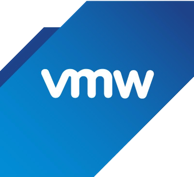

### 👾*Trent Due*

I'm a SysAdmin who's passionate about Windows, Linux, networking, cloud, and automation.

- 🪟 I’m currently a sever & cloud student at Microsoft's Systems and Software Academy.
- 💻 I’m currently learning Microsoft Azure, PowerShell, and Linux.
 
#
 
### 🧰 Languages and Tools

#

 

#
 #### Feel free to reach out via: [Linkedin](https://www.linkedin.com/in/trentdue) or [e-mail](mailto:trentdue@outlook.com)
